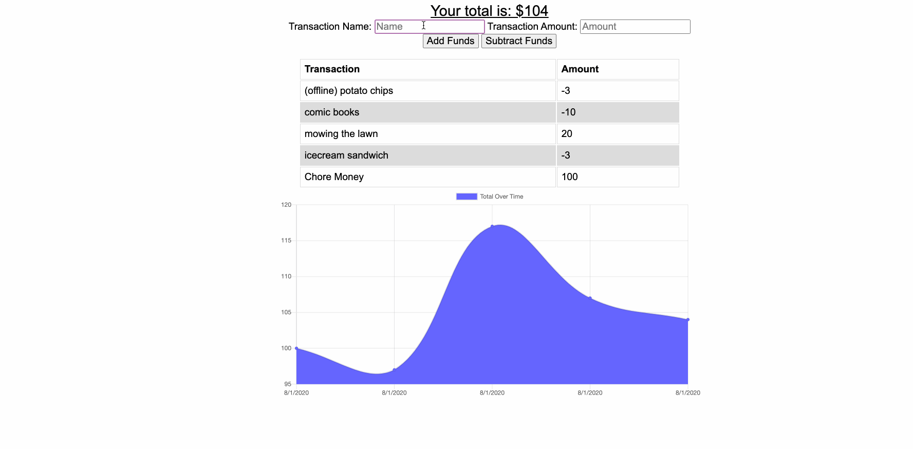
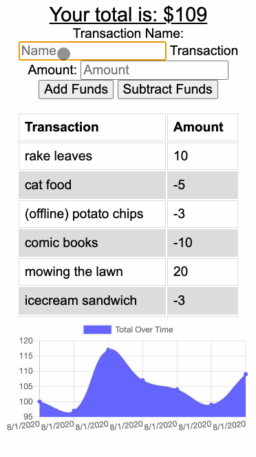

# Budget Tracker (PWA)
A budget tracker app to quickly & easily track your money, both online and offline by leveraging PWA technologies (e.g. service workers & indexedDB). Powered with a Node backend running an Express server & pulling data from a NoSQL DB using the Mongoose ORM.

<p align="center">
   
   
</p>

## Getting Started Remotely
Play on the hosted [site](https://bud-get-track-er.herokuapp.com/).
Or checkout the code in the [repo](https://github.com/Spazcool/budget-tracker).

## Getting Started Locally
### Prerequisites
* Node
* Mongo

### Instructions
1. Clone
```bash
git clone https://github.com/Spazcool/budget-tracker.git
```
2. Install dependencies
```bash
npm install
```
3. Run
```bash
node server
```

## Built With

* JS
  * Node
  * Express
  * Mongoose
  * IndexedDB
* DB
  * Mongo
* HTML
* CSS
  * Bootstrap

## Authors

* **Douglas Wright** - [Spazcool](https://github.com/Spazcool)

## License

This project is licensed under the MIT License - see the [LICENSE.md](LICENSE.md) file for details
